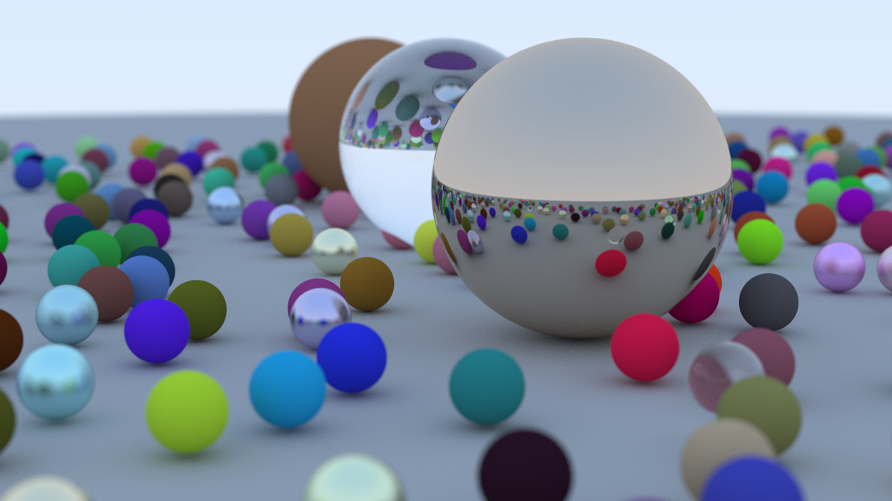

# Ray Tracing in One Weekend

This repository contains the code for the book "Ray Tracing in One Weekend" by Peter Shirley. The book is a great
introduction to ray tracing and computer graphics. The book is available for free on
the [Ray Tracing in One Weekend](https://raytracing.github.io/books/RayTracingInOneWeekend.html) website.

<div align="center">
    
    <br>
    <sub>Latest Image generated by the code</sub>
    <br>
    <mark><b>Image 99:</b> The Final Scene</mark>
</div>

## Building the Code

The code is written in C++ and uses the CMake build system. The code has been tested on MacOS.

To build the code, you need to have CMake installed. You can install CMake using Homebrew on MacOS.

```bash
brew install cmake
```

### Building the Code

- To build the code, you can use the following `make` commands.

```bash
# To build the code
make build

# To make latest version of the image
make latest

# To create PPMS, this will generate the PPM files in the `dist` directory.
make create

# To convert PPM to PNG, this will convert the PPM files to PNG files in the `dist` directory.
make convert

# To deploy (build, create PPM, convert PPM to PNG, and get the latest image).
make deploy

# To clean the build and dist directories along with the images.
make clean
```

## References

    Ray Tracing in One Weekend
    Peter Shirley, Trevor David Black, Steve Hollasch

    Version 4.0.0-alpha.2, 2024-04-07

    Copyright 2018-2024 Peter Shirley. All rights reserved.

    LICENSE https://github.com/RayTracing/raytracing.github.io/blob/dev/COPYING.txt

    https://github.com/RayTracing/raytracing.github.io
